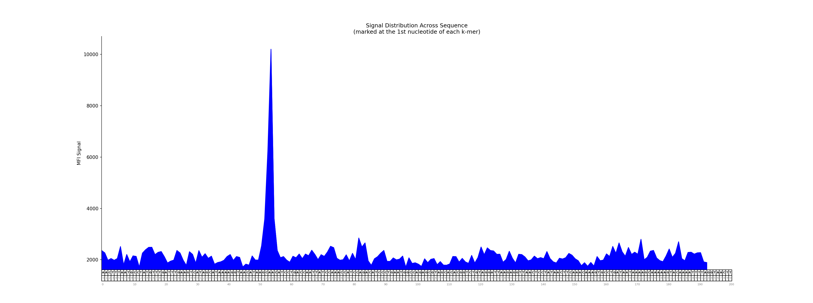

# tfsites.AffinityScan v1

**Author(s):** Joe Solvason  

**Contact:** Joe Solvason (solvason@eng.ucsd.edu)

**Adapted as a GenePattern Module by:** Ted Liefeld (jliefeld@cloud.ucsd.edu)

**Task Type:** Transciption factor analysis

**LSID:**  urn:lsid:genepattern.org:module.analysis:00446


## Introduction

Using PBM data, `AffinityScan` obtains the median fluorescence intensity (MFI) of every possible k-mer that exists in a given sequence and reports it as a bar graph. This analysis shows the binding preferences for a transcription factor across the sequence. 

## Methodology

The raw PBM dataset for a transcription factor is downloaded from [uniPROBE](http://the_brain.bwh.harvard.edu/uniprobe/). We iterate across every k-mer in the given sequence and obtain its MFI from the PBM dataset. The MFI for each k-mer is plotted as a bar on the graph, at the first nucleotide of the k-mer. The intensity of each bar's color is proportional to the value of the MFI compared to the median of all MFI values. The larger the MFI is from the median, the darker the color of the bar. Any bar that represents an MFI lower than the median is capped at a bottom threshold. 

## Parameters

<span style="color: red;">*</span> indicates required parameter

### Inputs and Outputs: 

- <span style="color: red;">*</span> **raw PBM data (.txt)**
    - File containing the raw PBM dataset for the transcription factor of interest obtained from uniPROBE. 
- <span style="color: red;">*</span> **bar graph of MFI across DNA sequence output filename (.png)**
    -  Name of the output file containing the bar graph of the MFI signal of k-mers across a sequence. 
 
### Analysis Parameters:

- <span style="color: red;">*</span>**DNA sequence to analyze (string)**
    - DNA sequence to scan for k-mers
- <span style="color: red;">*</span>**header present (boolean)**
    - If `True`, a header exists in the input PBM data file. If `False`, no header exists.
- <span style="color: red;">*</span>**column index of DNA k-mers (integer)**
    - Number of the column containing the forward DNA sequence in the input PBM file. (1-indexed, 1 is the first column)
- <span style="color: red;">*</span>**column index of MFI (integer)**
    - Number of the column containing the MFI signal in the input PBM file. (1-indexed, 1 is the first column)
 
### Plotting Parameters:
- **color of bar graph (string)**
    - `Default = gray`
    - Select the color of the bar graph. The color must be in the list of `matplotlib` named colors, which can be found [here](https://matplotlib.org/stable/gallery/color/named_colors.html).
- **plot dimensions (comma-separated integers)**
    - `Default = None`
    - Height and width of the image in inches.
- **plot resolution (integer)**
    - `Default = 200`
    - Resolution of the plot, in dots (pixels) per inch.
- **zoom range (dash-separated string)**
    - `Default = None`
    - Given a start position and an end position, zoom into a portion of the sequence. The numbers in the range are inclusive and 0-indexed. For example, the first 200 nucleotides of the sequence would be specified as: 0-199.


## Input Files

1.  raw PBM data (.tsv)
- Columns
    - `8-mer:` every possible forward k-mer sequence with length k
    - `8-mer:` the reverse complement of the forward k-mer
    - `E-score:` the enrichment score of the k-mer
    - `Median:` the median fluorescence intensity of the k-mer
    - `Z-score:` the z-score of the k-mer 

```
8-mer        8-mer        E-score     Median      Z-score
AAAAAAAA     TTTTTTTT     0.29130     2871.60     3.5965
AAAAAAAC     TTTTTTTG     0.10748     2086.00     0.3958
AAAAAAAG     TTTTTTTC     0.23656     2539.91     2.3673
AAAAAAAT     TTTTTTTA     0.21760     2434.82     1.9442
AAAAAACA     TTTTTTGT     0.19839     2407.46     1.8310
```
       
## Output Files

1. bar graph of MFI across DNA sequence (.png)

 
    
  
## Example Data

Example input data is available on github at [https://github.com/genepattern/tfsites.AffinityScan/tree/develop/gpunit/data](https://github.com/genepattern/tfsites.AffinityScan/tree/develop/gpunit/data)
    
    
## Version Comments

- **1.0.0** (2023-11-28): Initial draft of document scaffold.
- **1.0.1** (2024-02-02): Draft completed.
